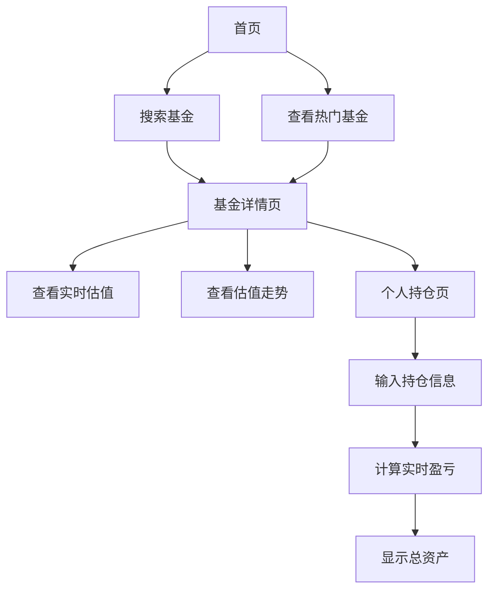

## 1. 产品概述
实时基金估值金融程序，通过基金重仓股的实时涨跌数据，精准计算基金实时估值变化。帮助投资者实时掌握基金收益情况，优化投资决策。

目标用户：基金投资者、理财用户、金融从业者。产品价值：提供准确的实时基金估值，让用户及时了解投资收益变化。

## 2. 核心功能

### 2.1 用户角色
| 角色 | 注册方式 | 核心权限 |
|------|----------|----------|
| 普通用户 | 无需注册，直接使用 | 搜索基金、查看估值、管理个人持仓 |

### 2.2 功能模块
核心页面包括：
1. **首页**：基金搜索、热门基金推荐、实时行情概览
2. **基金详情页**：实时估值、重仓股分析、估值走势图
3. **个人持仓页**：持仓管理、收益计算、实时盈亏展示

### 2.3 页面详情
| 页面名称 | 模块名称 | 功能描述 |
|-----------|-------------|-------------|
| 首页 | 搜索模块 | 输入基金代码或名称搜索，支持模糊匹配 |
| 首页 | 热门基金 | 展示市值前20的基金列表，显示实时估值涨跌幅 |
| 基金详情页 | 基本信息 | 显示基金名称、代码、类型、管理人等基础信息 |
| 基金详情页 | 实时估值 | 根据重仓股实时价格计算基金估值，**重点显示实时涨跌幅(%)**和估值金额 |
| 基金详情页 | 重仓股分析 | 展示前十大重仓股及权重，实时股价和涨跌幅 |
| 基金详情页 | 估值走势 | 当日实时估值折线图，支持1分钟、5分钟、15分钟粒度 |
| 个人持仓页 | 持仓录入 | 用户输入持有金额和持有收益，自动计算成本价 |
| 个人持仓页 | 实时盈亏 | 基于实时估值计算当前盈亏金额和收益率 |
| 个人持仓页 | 总资产 | 显示持仓总市值和当日盈亏变化 |

## 3. 核心流程

### 用户操作流程
1. **基金查询流程**：首页搜索基金 → 查看基金详情 → 查看实时估值和走势
2. **持仓管理流程**：个人持仓页 → 输入持仓金额和收益 → 实时查看盈亏情况
3. **估值监控流程**：添加关注的基金 → 实时监控估值变化 → 及时调整投资策略

## 4. 用户界面设计

### 4.1 设计风格
- **主色调**：金融蓝(#1E3A8A)搭配白色背景，体现专业可信
- **强调色**：涨跌红绿配色，上涨用红色(#DC2626)，下跌用绿色(#16A34A)
- **按钮样式**：圆角矩形，主要操作用主色调，次要操作用灰色
- **字体选择**：系统默认字体，数字使用等宽字体便于对比
- **布局风格**：卡片式布局，信息层级清晰，重要数据突出显示
- **图标风格**：使用简洁的线性图标，符合金融应用调性

### 4.2 页面设计概览
| 页面名称 | 模块名称 | UI元素 |
|-----------|-------------|-------------|
| 首页 | 搜索框 | 顶部固定搜索栏，占位符显示"输入基金代码或名称" |
| 首页 | 基金列表 | 卡片式布局，每行显示基金名称、代码、实时估值涨跌幅，涨跌幅用红绿背景突出 |
| 基金详情页 | 估值卡片 | 顶部大卡片显示当前估值、涨跌幅、估值时间，数据用大号字体 |
| 基金详情页 | 重仓股列表 | 表格形式展示，包含股票名称、权重、现价、涨跌幅，支持排序 |
| 基金详情页 | 走势图 | Recharts折线图，显示当日估值变化，支持时间粒度切换 |
| 个人持仓页 | 持仓卡片 | 输入框收集持仓金额和收益，实时计算并显示当前盈亏 |

### 4.3 响应式设计
- **桌面优先**：优先适配桌面端，充分利用屏幕空间展示数据
- **移动端适配**：支持平板和手机访问，采用响应式布局
- **触摸优化**：移动端增大点击区域，优化滑动和缩放操作

### 4.4 数据可视化指导
- **图表类型**：使用折线图展示估值走势，支持多条线对比
- **颜色规范**：估值线使用主色调，参考基准线使用灰色
- **交互设计**：支持悬停查看具体数值，点击图例切换显示
- **更新频率**：实时数据每30秒自动刷新，保持数据新鲜度