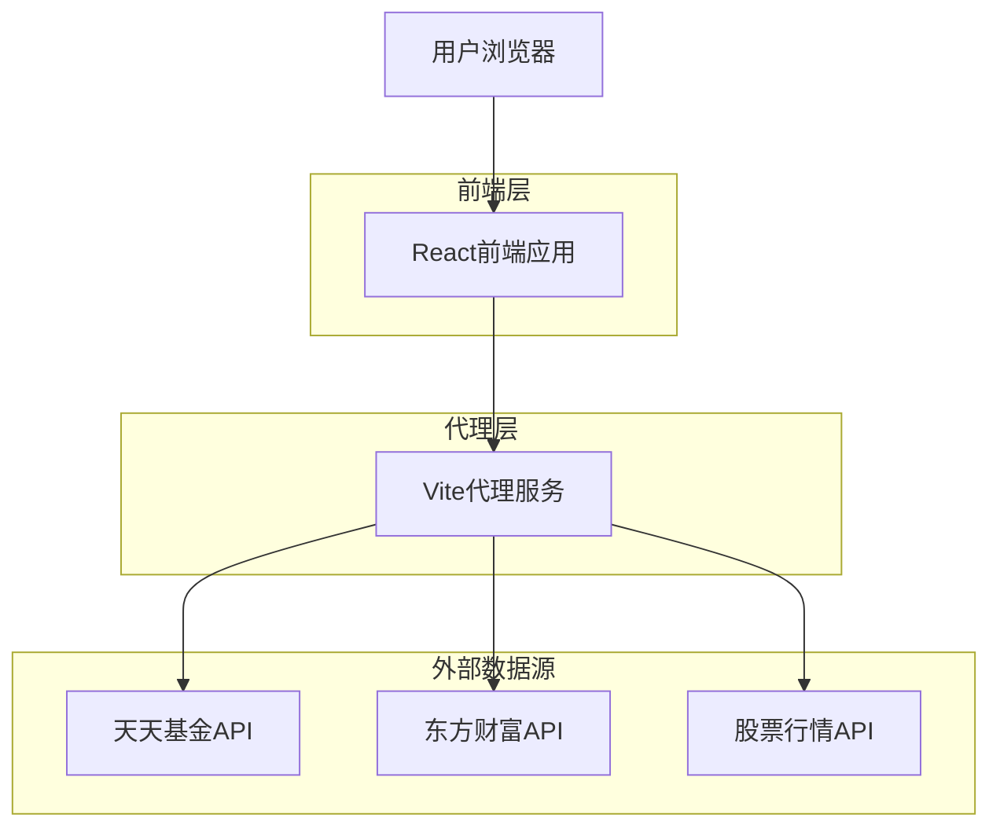

## 1. 架构设计



## 2. 技术描述

- **前端**: React@18 + TypeScript + Tailwind CSS@3 + Vite
- **初始化工具**: vite-init
- **图表库**: Recharts
- **HTTP客户端**: Axios
- **数据处理**: Day.js(时间处理)
- **状态管理**: React Context + useReducer
- **后端**: 无独立后端，通过Vite代理解决CORS问题

## 3. 路由定义

| 路由 | 用途 |
|-------|---------|
| / | 首页，基金搜索和热门基金展示 |
| /fund/:code | 基金详情页，显示实时估值和走势 |
| /portfolio | 个人持仓页，管理持仓和查看收益 |

## 4. API接口定义

### 4.1 基金信息API
```
GET /api/fund/basic-info?code={fundCode}
```

请求参数：
| 参数名 | 参数类型 | 是否必需 | 描述 |
|-----------|-------------|-------------|-------------|
| code | string | true | 基金代码 |

响应数据：
```json
{
  "fundCode": "000001",
  "fundName": "华夏成长混合",
  "fundType": "混合型",
  "company": "华夏基金",
  "manager": "张三",
  "establishDate": "2001-01-01",
  "totalAssets": "100.5亿"
}
```

### 4.2 基金持仓API
```
GET /api/fund/holdings?code={fundCode}
```

响应数据：
```json
{
  "holdings": [
    {
      "stockCode": "000001.SZ",
      "stockName": "平安银行",
      "weight": 8.5,
      "shares": 1000000,
      "marketValue": "1.2亿"
    }
  ],
  "totalWeight": 45.2,
  "reportDate": "2024-12-31"
}
```

### 4.3 实时股价API
```
GET /api/stock/realtime?codes={stockCodes}
```

请求参数：
| 参数名 | 参数类型 | 是否必需 | 描述 |
|-----------|-------------|-------------|-------------|
| codes | string | true | 股票代码，逗号分隔 |

响应数据：
```json
{
  "stocks": [
    {
      "code": "000001.SZ",
      "name": "平安银行",
      "currentPrice": 12.45,
      "change": 0.25,
      "changePercent": 2.04,
      "volume": 1254300,
      "updateTime": "15:00:01"
    }
  ]
}
```

### 4.4 基金估值计算API
```
GET /api/fund/valuation?code={fundCode}
```

响应数据：
```json
{
  "fundCode": "000001",
  "estimatedValue": 1.2345,
  "previousValue": 1.2000,
  "change": 0.0345,
  "changePercent": 2.88,
  "calculationTime": "15:00:02",
  "reliability": 0.85
}
```

## 5. 数据模型定义

### 5.1 基金信息模型
```typescript
interface FundInfo {
  code: string;
  name: string;
  type: string;
  company: string;
  manager: string;
  establishDate: string;
  totalAssets: string;
}

interface FundHolding {
  stockCode: string;
  stockName: string;
  weight: number;
  shares: number;
  marketValue: string;
}

interface StockRealtime {
  code: string;
  name: string;
  currentPrice: number;
  change: number;
  changePercent: number;
  volume: number;
  updateTime: string;
}

interface FundValuation {
  fundCode: string;
  estimatedValue: number;
  previousValue: number;
  change: number;
  changePercent: number;
  calculationTime: string;
  reliability: number;
}
```

### 5.2 用户持仓模型
```typescript
interface UserPortfolio {
  fundCode: string;
  holdingAmount: number; // 持仓金额
  holdingProfit: number; // 持有收益
  costPrice: number; // 成本价
  currentValue: number; // 当前价值
  currentProfit: number; // 当前盈亏
  profitRate: number; // 收益率
  updateTime: string;
}
```

## 6. 估值算法说明

### 6.1 实时估值计算
1. **实时涨跌幅(%)** = ∑(重仓股权重 × 股票实时涨跌幅)
2. **实时估值** = 前一日净值 × (1 + 实时涨跌幅)
3. **估值变动额** = 实时估值 - 前一日净值

计算步骤：
1. 获取基金前十大重仓股及权重
2. 获取各股票实时涨跌幅
3. 按权重计算加权平均涨跌幅作为基金的实时涨跌幅
4. 应用到前一日净值得到当前估值

### 6.2 可靠性评估
- 重仓股覆盖率 ≥ 80%：可靠性 0.9-1.0
- 重仓股覆盖率 60-80%：可靠性 0.7-0.9
- 重仓股覆盖率 < 60%：可靠性 0.5-0.7

## 7. 数据源配置

### 7.1 天天基金API
- **基金基本信息**: http://fund.eastmoney.com/pingzhongdata/{code}.js
- **基金持仓数据**: http://fundf10.eastmoney.com/ccmx_{code}.html
- **实时估值**: 通过重仓股计算获得

### 7.2 股票行情API
- **实时行情**: http://hq.sinajs.cn/list={code}
- **涨跌幅数据**: 通过新浪财经API获取

### 7.3 Vite代理配置
```typescript
// vite.config.ts
server: {
  proxy: {
    '/api/fund': {
      target: 'http://fund.eastmoney.com',
      changeOrigin: true,
      rewrite: (path) => path.replace(/^\/api\/fund/, '')
    },
    '/api/stock': {
      target: 'http://hq.sinajs.cn',
      changeOrigin: true,
      rewrite: (path) => path.replace(/^\/api\/stock/, '')
    }
  }
}
```

## 8. 性能优化

### 8.1 数据缓存策略
- **基金基本信息**: 缓存24小时
- **基金持仓数据**: 缓存4小时
- **实时股价**: 缓存30秒
- **计算估值**: 缓存1分钟

### 8.2 请求优化
- 批量请求股票数据，减少HTTP请求次数
- 使用请求去重，避免重复请求相同数据
- 实现请求失败重试机制

### 8.3 前端优化
- 使用React.memo减少不必要的组件重渲染
- 实现虚拟滚动优化长列表性能
- 使用Web Worker处理复杂计算